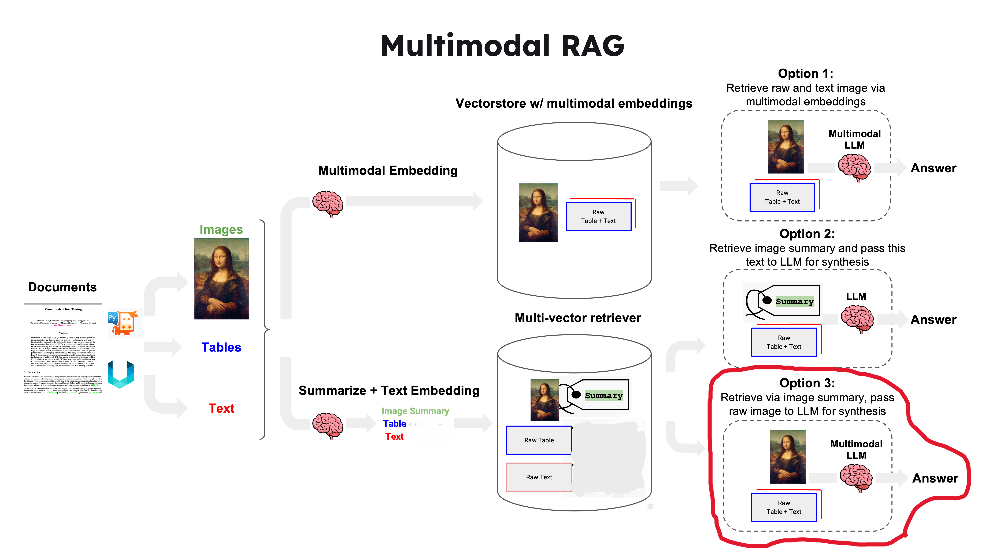
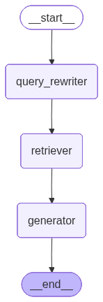

# Agentic RAG on My Notes

A RAG system for chatting with your PDF documents. Upload files, ask questions, and get answers with source citations.

Built with **LangGraph** (agentic workflow), **Weaviate** (vector database with local embeddings & reranking), **FastAPI** (API), and **Gemini** (LLM).

<!-- TODO: Replace with your own demo gif/video -->
<!--  -->

<p align="center">
  
  <br>
  <em>Ask questions → get answers with inline citations</em>
</p>

<p align="center">
  
  <br>
  <em>Upload PDFs → background ingestion with status tracking</em>
</p>

---

## What It Does

1. **Upload PDFs** → extracts text, images, and tables → stores chunks in Weaviate
2. **Ask questions** → rewrites your query → hybrid search + reranking → generates answer with citations
3. **Multimodal** → images/tables are captioned by LLM and included as visual context during generation

---

## 1. Ingestion Pipeline

How documents go from raw PDF to searchable chunks in Weaviate.

<!-- TODO: Replace with your ingestion process screenshot or diagram -->
<p align="center">
  
  <br>
  <em>Document ingestion — PDF extraction, image summarization, chunking, and storage</em>
</p>

```
PDF Upload → Partition → Filter → Caption Attachment → Image Summarization → Chunking → Store
```

### Key Techniques

**Multimodal PDF Extraction** — uses `unstructured` with `hi_res` strategy to extract text, images, and tables as separate typed elements. Images/tables are saved as files (150 DPI). OCR runs on individual blocks only (not full-page) to avoid redundant processing.

**Intelligent Filtering** — removes noise (headers, uncategorized text, elements ≤ 2 chars) and discards insignificant images < 10KB (logos, icons, decorative elements) to keep the index clean.

**Caption Attachment** — custom logic to link captions to their images/tables using document order and direction conventions (image captions appear below, table captions appear above). Matched caption elements are removed to avoid duplicate content in the index. Regex-based detection handles variations like `Figure 1:`, `Table A.1:`, `Fig. 3:`.

**Parallel Image Summarization** — each image + its caption is sent to Gemini vision to generate an information-dense text summary optimized for vector search. Runs in `ThreadPoolExecutor` (5 workers) for speed on image-heavy PDFs.

**Two-Stage Chunking** — first groups text by title/heading structure (`chunk_by_title`, max 10K chars), then splits further with `RecursiveCharacterTextSplitter` (1500 chars). Image/table chunks are kept intact with their summaries. This preserves semantic coherence within headings while keeping chunks retrieval-friendly.

---

## 2. Retrieval & Generation

How user queries get answered — the agentic RAG pipeline.

<!-- TODO: Replace with your RAG workflow diagram (e.g. LangGraph visualization) -->
<!--  -->


### Key Techniques

**Agentic Workflow (LangGraph)** — the pipeline is a 3-node state graph (`query_rewriter → retriever → generator`) compiled with a checkpointer for conversation memory. Each request passes through all nodes with shared state, keeping the architecture modular and testable.

**Query Preprocessing** — a dedicated small/fast model (`gemini-2.0-flash`) rewrites raw user input before retrieval:
- Resolves pronouns using the last 3 turns of chat history
- Fixes typos and strips filler phrases
- Decomposes complex queries into 1–3 orthogonal sub-queries (e.g., "Compare A and B" → two separate searches)
- Output is a strict JSON array — parsed with regex fallback for robustness

**Hybrid Search** — combines BM25 keyword matching + vector similarity (α=0.5) for each sub-query. This catches both exact term matches and semantic similarity, which neither approach achieves alone.

**Cross-Encoder Reranking** — initial candidates (top 25) are reranked by a cross-encoder model (`ms-marco-MiniLM-L-6-v2`, runs locally in Docker) down to top 7. This two-stage approach balances recall (wide initial net) with precision (reranker filters noise).

**Multimodal Generation** — the generator sends image/table chunks as base64-encoded images alongside text to Gemini, enabling vision-aware answers. The prompt enforces inline `[1][2]` citations with source attribution.

**Conversation Memory** — `InMemorySaver` checkpointer preserves chat history per session, so follow-up questions resolve correctly (e.g., "tell me more about it" → resolves "it" from context).

---

## Tech Stack

| Component | Technology |
|---|---|
| Agentic workflow | LangGraph (3-node state graph with checkpointer) |
| Vector database | Weaviate (self-hosted via Docker) |
| Embeddings | `google-gemma-3-300m-embedding` (local, Docker) |
| Reranker | `cross-encoder-ms-marco-MiniLM-L-6-v2` (local, Docker) |
| LLM | Gemini 2.0 Flash (rewriting) + Gemini 2.5 Flash Lite (generation) |
| PDF processing | Unstructured (hi-res extraction) |
| API | FastAPI (async, background jobs) |
| Frontend | Vanilla HTML/CSS/JS |

## Project Structure

```
├── src/
│   ├── rag_workflow.py       # LangGraph agent (query rewriter → retriever → generator)
│   ├── retriever.py          # Hybrid search + reranking
│   ├── ingest.py             # PDF processing and Weaviate ingestion
│   ├── api.py                # FastAPI endpoints
│   ├── collection_service.py # Weaviate collection CRUD
│   ├── config.py             # Settings (pydantic-settings)
│   ├── utils.py              # Caption attachment, base64 encoding
│   └── logging_config.py     # Logging
├── static/                   # Chat UI (index.html, style.css, app.js)
├── notebooks/                # Experiments & evaluation (see notebooks/README.md)
├── docker-compose.yaml       # Weaviate + local embeddings + reranker
├── main.py                   # Entry point
├── requirements.txt
└── requirements-dev.txt      # Notebook & eval dependencies
```

## Getting Started

### Prerequisites
- Python 3.10+
- Docker & Docker Compose
- [Gemini API key](https://aistudio.google.com/apikey)

### Setup

```bash
# 1. Clone
git clone https://github.com/YOUR_USERNAME/agentic-rag.git
cd agentic-rag

# 2. Environment
cp .env.example .env
# Edit .env → add your GEMINI_API_KEY

# 3. Start Weaviate (embeddings + reranker run locally)
docker compose up -d

# 4. Install dependencies
pip install -r requirements.txt

# 5. Run
python main.py
# → http://localhost:8000
```

### Usage

1. Open `http://localhost:8000`
2. Create a collection in the sidebar
3. Upload PDF files (ingestion runs in background)
4. Start asking questions

## API

```
GET    /health                                    # Health check
GET    /collections                               # List collections
POST   /collections              {"name": "..."}  # Create collection
DELETE /collections/{name}                         # Delete collection

POST   /collections/{name}/documents  (file)      # Upload & ingest PDF
GET    /collections/{name}/documents              # List documents
DELETE /collections/{name}/documents/{filename}   # Delete document

GET    /jobs/{job_id}                              # Ingestion job status

POST   /collections/{name}/chat                   # Chat with documents
       {"message": "...", "session_id": "..."}
```

## Evaluation

Evaluated with [RAGAS](https://docs.ragas.io/) on a synthetic test set (21 queries) across 3 difficulty levels.

### Generation Quality

| Metric | Mean |
|---|---|
| Faithfulness | 0.92 |
| Answer Relevancy | 0.82 |

### Retrieval Quality

| Query Type | Samples | Recall | Precision |
|---|---|---|---|
| Single-hop specific | 7 | 0.86 | 0.71 |
| Multi-hop specific | 7 | 1.00 | 0.69 |
| Multi-hop abstract | 7 | 0.48 | 0.44 |

> Precision/recall use fuzzy (non-LLM) text matching against reference contexts.

**Key takeaways:**
- High faithfulness (0.92) — model rarely hallucinates beyond retrieved docs
- Multi-hop specific queries achieve perfect recall with decent precision
- Multi-hop abstract queries are the weakest — room for better query decomposition

Full evaluation pipeline: [`notebooks/synthetic_test_dataset.ipynb`](notebooks/synthetic_test_dataset.ipynb)

## Configuration

### Models (`src/rag_workflow.py`)

```python
'large_kwargs': {  # Generation
    'model': 'gemini-2.5-flash-lite',
    'temperature': 0.3,
},
'small_kwargs': {  # Query rewriting
    'model': 'gemini-2.0-flash',
    'temperature': 0.3,
},
```

### Retrieval (`src/retriever.py`)

```python
alpha = 0.5          # Hybrid weight (0=keyword, 1=vector)
top_k = 25           # Candidates before reranking
top_k_reranker = 7   # Results after reranking
```

### Environment Variables

| Variable | Required | Default |
|---|---|---|
| `GEMINI_API_KEY` | Yes | — |
| `WEAVIATE_HOST` | No | `localhost` |
| `WEAVIATE_HTTP_PORT` | No | `8080` |
| `WEAVIATE_GRPC_PORT` | No | `50051` |

## License

MIT
