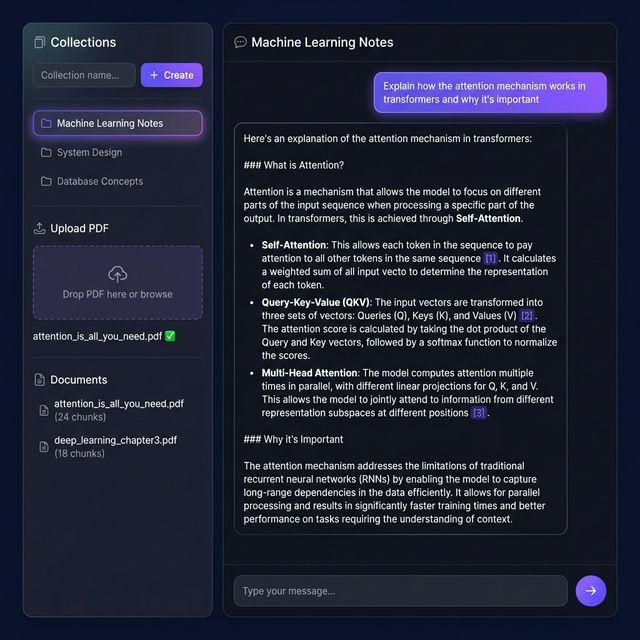
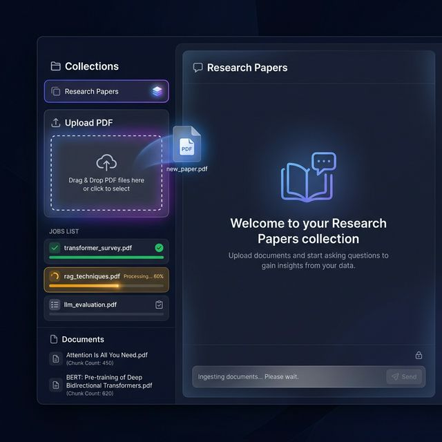
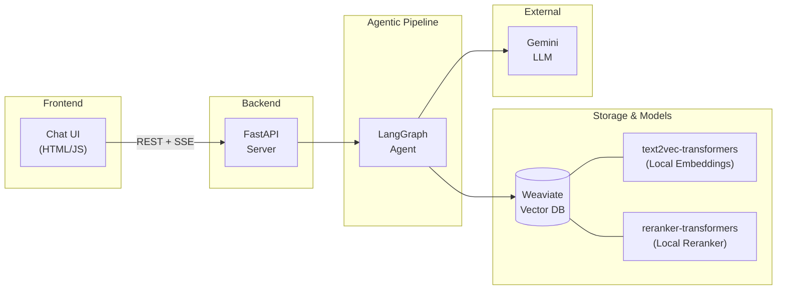
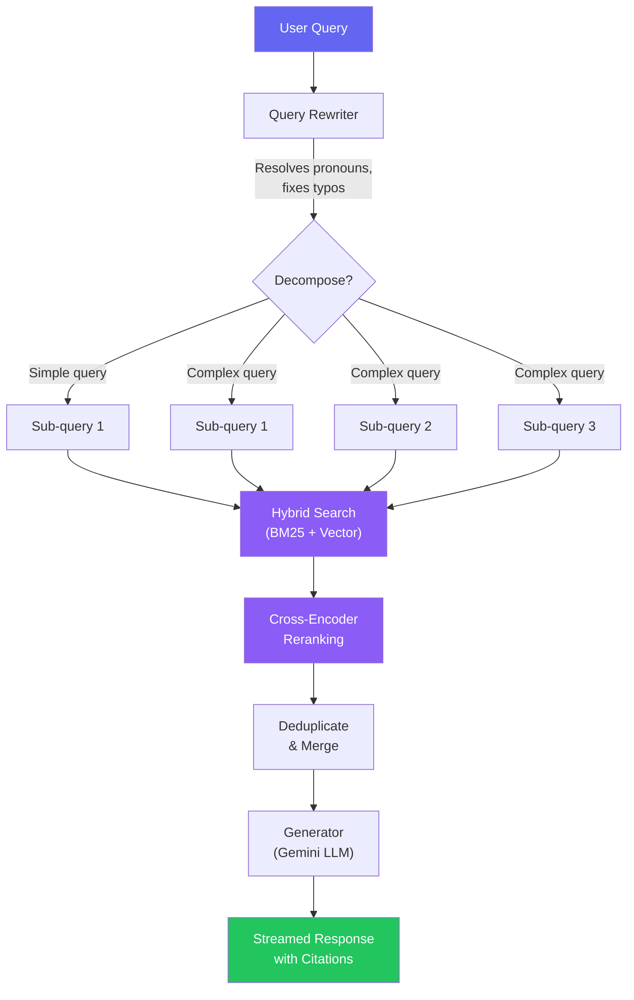

# Agentic RAG on My Notes

An intelligent Retrieval-Augmented Generation (RAG) system that enables conversational interaction with your personal notes and documents. Built with LangGraph for agentic workflows, Weaviate for vector storage, and a clean web interface.

## Demo

<p align="center">
  
  <br>
  <em>Chat interface — ask questions and receive answers with inline source citations</em>
</p>

<p align="center">
  
  <br>
  <em>Document ingestion — upload PDFs with real-time processing status</em>
</p>

## Overview

This system uses an agentic workflow to intelligently retrieve and synthesize information from your documents:
- **Query Planning**: Breaks complex queries into focused sub-queries
- **Hybrid Retrieval**: Combines semantic and keyword search with reranking
- **Multimodal Support**: Processes both text and images from PDFs
- **Citation Responses**: Answers with inline source citations

## Architecture

### System Overview



### Agentic RAG Workflow



## Project Structure

```
.
├── src/
│   ├── api.py               # FastAPI endpoints (chat, collections, ingestion)
│   ├── rag_workflow.py       # LangGraph agent workflow (AgenticRAG)
│   ├── ingest.py             # Document ingestion pipeline
│   ├── retriever.py          # Hybrid search & reranking
│   ├── collection_service.py # Weaviate collection CRUD
│   ├── config.py             # Settings via pydantic-settings
│   ├── utils.py              # Shared utilities (base64, formatters)
│   └── logging_config.py     # Structured logging setup
├── static/
│   ├── index.html            # UI structure
│   ├── style.css             # Styling
│   └── app.js                # Frontend logic & SSE streaming client
├── data/
│   ├── raw/                  # Source documents (per-collection subfolders)
│   └── processed/            # Extracted images & tables
├── notebooks/                # Experiments & evaluation notebooks
├── main.py                   # Uvicorn entry point
├── docker-compose.yaml       # Weaviate + vectorizer + reranker
├── requirements.txt          # Production dependencies
└── requirements-dev.txt      # Dev/notebook dependencies
```

## Prerequisites

- Python 3.10+
- Docker & Docker Compose
- Gemini API Key (for LLM)

## Setup

1.  **Clone and navigate to project:**

    ```bash
    cd "Agentic RAG on my notes"
    ```

2.  **Configure environment variables:**

    Copy `.env.example` to `.env` and fill in your keys:
    ```bash
    GEMINI_API_KEY=your_gemini_api_key_here
    ```

3.  **Start Weaviate vector database:**

    ```bash
    docker compose up -d
    ```

4.  **Install Python dependencies:**

    ```bash
    pip install -r requirements.txt
    ```

## Quick Start

1.  **Start the server:**

    ```bash
    python main.py
    ```
    Server runs at `http://localhost:8000`

2.  **Open the UI:**

    Navigate to `http://localhost:8000` in your browser (served by FastAPI)

3.  **Create a collection & upload documents:**

    - Use the sidebar to create a new collection
    - Drag & drop PDF files to upload
    - Ingestion runs in the background — watch the status indicator

4.  **Start chatting:**

    Ask questions about your documents in the chat interface

## API Documentation

### Collections

```http
GET  /collections                              # List all collections
POST /collections         {"name": "MyNotes"}  # Create collection
DELETE /collections/{name}                      # Delete collection
```

### Documents

```http
GET  /collections/{name}/documents                        # List documents
POST /collections/{name}/documents   (multipart: file)    # Upload & ingest PDF
DELETE /collections/{name}/documents/{filename}            # Delete document
```

### Ingestion Jobs

```http
GET /jobs/{job_id}   # Poll background ingestion status
```

### Chat

```http
POST /collections/{name}/chat
{"message": "What is RAG?", "session_id": "optional-session-id"}
# Returns: { response, retrieved_documents[] }
```

### Health

```http
GET /health   # Returns: {"status": "healthy"}
```

## Features

### 🤖 Agentic Workflow
- **Query Rewriting**: Contextualizes queries using chat history, cleans typos, strips filler
- **Orthogonal Decomposition**: Breaks complex queries into up to 3 non-overlapping sub-queries
- **Conversation Memory**: Maintains context across chat sessions via LangGraph checkpointer

### 📚 Document Processing
- **Supported Format**: PDF (with embedded images and tables)
- **Image Extraction**: Extracts images/tables via `unstructured`, generates LLM captions
- **Multimodal Context**: Images are sent as base64 to Gemini for vision-aware generation

### 🔍 Advanced Retrieval
- **Hybrid Search**: Combines vector similarity + keyword matching (BM25)
- **Reranking**: Cross-encoder reranking for precision
- **Configurable Parameters**: `alpha` (vector/keyword weight), `top_k`, `top_k_reranker`

### 💬 Chat Interface
- **Source Citations**: Inline `[1][2]` references with hover tooltips (text + images)
- **Markdown Support**: Headers, lists, code blocks, bold/italic
- **Keyboard Shortcuts**: Enter to send, Shift+Enter for newline

## How It Works

### 1. Document Ingestion Pipeline
```
PDF → Extract Elements → Partition Text/Images/Tables → Caption Images → Embed → Store in Weaviate
```
- Extracts text, images, and tables using `unstructured`
- Generates LLM captions for images and table summaries
- Creates embeddings using `text2vec-transformers` (Weaviate module)
- Stores in Weaviate with metadata (source, page number, type, image path)

### 2. Agentic RAG Workflow
```
Query → Query Rewriter → Retriever → Generator → Streamed Response
```

**Query Rewriter Node:**
- Resolves pronouns using chat history
- Cleans typos and strips filler
- Decomposes into sub-queries if needed (max 3)

**Retriever Node:**
- Executes hybrid search for each sub-query
- Applies reranking for relevance
- Deduplicates across sub-queries

**Generator Node:**
- Formats retrieved documents with citations
- Includes images as base64 for multimodal context
- Generates response with inline citations

### 3. Retrieval Strategy
```python
# Hybrid search with reranking
alpha=0.5  # 50% vector, 50% keyword
top_k=25   # Initial candidates per sub-query
top_k_reranker=7  # Final results after reranking
```

## Configuration

### Model Settings (src/rag_workflow.py)
```python
param_dict = {
    'large_kwargs': {  # For RAG generation
        'model': 'gemini-2.5-flash',
        'temperature': 0.1,
        'top_p': 0.3,
    },
    'small_kwargs': {  # For query rewriting
        'model': 'gemini-2.0-flash',
        'temperature': 0.1,
        'top_p': 0.3,
    },
}
```

### Environment Variables (.env)
| Variable | Required | Description |
|---|---|---|
| `GEMINI_API_KEY` | Yes | Google Gemini API key |
| `OPENAI_API_KEY` | No | For evaluation notebooks |
| `UNSTRUCTURED_API_KEY` | No | For hosted Unstructured API |
| `WEAVIATE_HOST` | No | Default: `localhost` |
| `WEAVIATE_HTTP_PORT` | No | Default: `8080` |
| `WEAVIATE_GRPC_PORT` | No | Default: `50051` |

### Weaviate Configuration (docker-compose.yaml)
- Port: 8080 (HTTP), 50051 (gRPC)
- Vectorizer: `text2vec-transformers`
- Reranker: `reranker-transformers`
- Persistence: Bind mount to `./collections`

## Supported File Types

- **PDF**: `.pdf` (with image and table extraction)

## Troubleshooting

**Weaviate connection error:**
```bash
docker compose ps         # Check if Weaviate is running
docker compose logs weaviate  # View logs
```

**Import errors:**
```bash
pip install -r requirements.txt --upgrade
```

**No documents found:**
- Ensure you've uploaded documents to a collection via the UI
- Check that ingestion job completed successfully (green ✅ indicator)

**Slow ingestion:**
- Image extraction and captioning is the bottleneck
- Large PDFs with many images will take longer

## Development

### Customizing Prompts

Edit prompts in `src/rag_workflow.py`:
- `query_rewriter()`: Query decomposition and cleaning prompt
- `generator()` / `_build_rag_messages()`: Answer generation prompt

### Extending API

Add endpoints in `src/api.py` (before the static files mount):
```python
@app.get("/my-endpoint")
async def my_endpoint():
    return {"data": "value"}
```

## Performance Tips

- Adjust `alpha` based on query type (experiment between 0.3–0.7)
- Increase `top_k_reranker` for higher recall, decrease for speed
- Use `gemini-2.0-flash` for faster responses at lower cost

## Evaluation

Evaluation was performed using [RAGAS](https://docs.ragas.io/) on a **synthetic test dataset** (21 samples) generated from the ingested documents. The test set includes diverse query types and styles to stress-test both the retrieval and generation components.

### Methodology

1. **Synthetic Test Set Generation** — A knowledge graph was built from the document collection using RAGAS, and test queries were synthesized across 3 difficulty levels (single-hop specific, multi-hop specific, multi-hop abstract) with varied query styles (perfect grammar, web search, poor grammar, misspelled).
2. **Retrieval Evaluation** — Each test query was run through the full agentic pipeline (query rewriting → hybrid search → reranking). Retrieved contexts were compared against reference contexts using exact-match and fuzzy (non-LLM) precision/recall.
3. **Generation Evaluation** — The final generated answers were evaluated for **faithfulness** (factual consistency with retrieved context) and **answer relevancy** (whether the response addresses the question).

### Retrieval Configuration

```python
alpha = 0.5              # Hybrid search: 50% vector, 50% keyword (BM25)
top_k = 25               # Initial candidates per sub-query
top_k_reranker = 7        # Final results after cross-encoder reranking
query_rewriter = "gemini-2.0-flash"   # Query decomposition model
generator = "gemini-2.5-flash"        # Answer generation model
```

### Results Summary

#### Generation Quality

| Metric | Mean | Median | Min | Max |
|--------|------|--------|-----|-----|
| **Faithfulness** | 0.923 | 0.979 | 0.615 | 1.000 |
| **Answer Relevancy** | 0.818 | 0.820 | 0.658 | 0.933 |

> **Faithfulness ≈ 0.92** means the model rarely generates claims unsupported by the retrieved documents. **Answer Relevancy ≈ 0.82** confirms responses directly address the user's question across diverse query styles.

#### Retrieval Quality

| Metric | Mean | Median | Perfect (1.0) | Zero (0.0) |
|--------|------|--------|---------------|------------|
| **Exact Recall** | 0.730 | 1.000 | 66.7% | 19.0% |
| **Exact Precision** | 0.107 | 0.100 | 0.0% | 19.0% |
| **Fuzzy Recall** | 0.778 | 1.000 | 66.7% | 9.5% |
| **Fuzzy Precision** | 0.614 | 0.500 | 0.0% | 9.5% |

> **Exact match** requires retrieved chunks to be identical to reference contexts. **Fuzzy (non-LLM)** matching uses text overlap, which better captures partial matches. The high recall (0.73–0.78) shows the retriever successfully finds relevant documents in most cases.

#### Retrieval by Query Type

| Query Type | Samples | Exact Recall | Fuzzy Recall | Exact Precision | Fuzzy Precision |
|------------|---------|-------------|-------------|----------------|----------------|
| **Single-hop Specific** | 7 | 0.857 | 0.857 | 0.114 | 0.714 |
| **Multi-hop Specific** | 7 | 1.000 | 1.000 | 0.133 | 0.691 |
| **Multi-hop Abstract** | 7 | 0.333 | 0.476 | 0.074 | 0.437 |

> **Multi-hop specific** queries achieve perfect recall — the retriever excels at finding all relevant chunks when queries target concrete facts across documents. **Multi-hop abstract** queries are the hardest, with recall dropping to 0.33–0.48, indicating room for improvement in handling abstract reasoning queries.

### Key Observations

- **Low precision is expected** — the retriever casts a wide net (`top_k=25`, reranked to 7) to maximize recall, meaning many retrieved chunks aren't in the reference set but may still be relevant.
- **Query rewriting handles noise well** — the system handles misspelled and poorly-formed queries nearly as well as perfect grammar queries.
- **Abstract queries are the bottleneck** — multi-hop abstract queries (requiring synthesis across multiple documents) have the lowest recall, suggesting the query rewriter could benefit from better decomposition strategies for abstract questions.

See [`notebooks/synthetic_test_dataset.ipynb`](notebooks/synthetic_test_dataset.ipynb) for the full evaluation pipeline, including the synthetic dataset generation, retrieval analysis, and error breakdowns.

## License

MIT

## Acknowledgments

- LangGraph for agentic workflows
- Weaviate for vector database
- Google Gemini for LLM capabilities
- LangChain for document processing
- Unstructured for PDF element extraction
