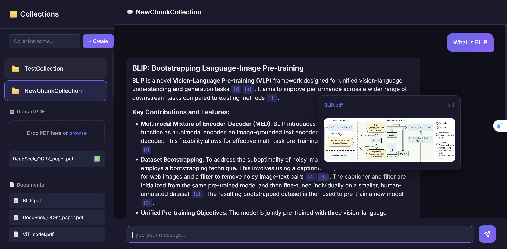
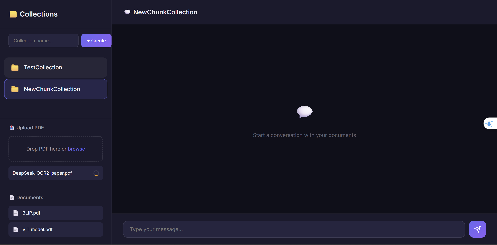
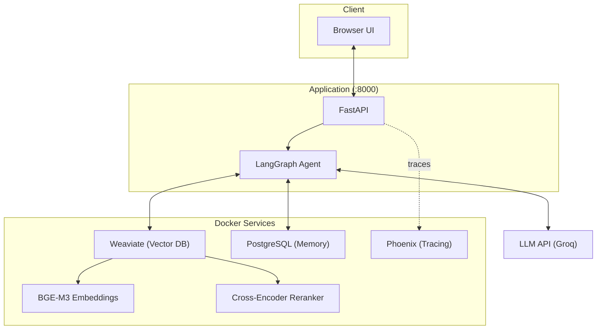
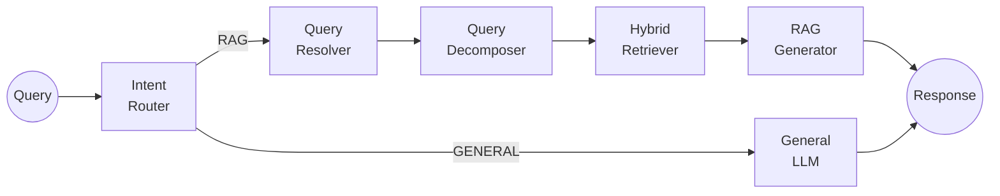
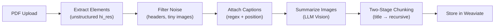

# Agentic RAG on My Notes

<p align="center">
  <a href="https://www.python.org/"></a>
  <a href="https://fastapi.tiangolo.com/"></a>
  <a href="https://www.docker.com/"></a>
  <a href="https://www.postgresql.org/"></a>
  <br>
  <a href="https://weaviate.io/"></a>
  <a href="https://langchain-ai.github.io/langgraph/"></a>
  <a href="https://groq.com/"></a>
  <a href="https://opensource.org/licenses/MIT"></a>
</p>

**A local-first, privacy-focused agentic RAG system that lets you chat with your PDF documents.**

Upload files, ask questions, and get answers with source citations — powered by a multi-step AI workflow that rewrites your query, searches intelligently, and generates grounded answers.

### ✨ Key Features
- **Agentic Workflow**: A LangGraph state machine handles query intent, decomposition, and conversational context automatically.
- **Multimodal Ingestion**: Extracts text, tables, and images from PDFs (with AI image summarization).
- **Hybrid Search**: Combines BM25 keywords and Vector semantics with Cross-Encoder reranking for high precision.
- **Local-First Privacy**: Embeddings and rerankers run locally via Docker. Only the LLM generation calls an external API.
- **Persistent Memory**: Chat history is saved in PostgreSQL across restarts.

---

<!-- TODO: Record a ~20s GIF showing: upload a PDF → ask a question → see streamed answer with citations -->
<!--  -->

<p align="center">
  
  <br>
  <em>Ask questions → get answers with inline citations and source documents</em>
</p>

<p align="center">
  
  <br>
  <em>Upload PDFs → background ingestion with real-time status tracking</em>
</p>

---

## 📑 Table of Contents
- [Getting Started](#-getting-started)
- [How it Works](#-how-it-works)
  - [System Architecture](#system-architecture)
  - [Agentic Workflow](#agentic-workflow)
  - [Ingestion Pipeline](#ingestion-pipeline)
- [Design Decisions](#-design-decisions)
- [Evaluation](#-evaluation)
- [Configuration & API](#-configuration--api)
- [Tech Stack & Structure](#-tech-stack--structure)
- [License](#-license)

---

## 🚀 Getting Started

### Prerequisites

- Python 3.10+
- Docker & Docker Compose
- A [Groq API key](https://console.groq.com/keys) (free tier works)
- **Available Ports:** Ensure ports `8000` (API), `8080` (Weaviate), `5432` (Postgres), and `6006` (Phoenix) are not in use by other services on your machine.

### Setup

```bash
# 1. Clone
git clone https://github.com/phuocNg964/multimodal-knowledge-base.git
cd multimodal-knowledge-base

# 2. Environment
cp .env.example .env
# Edit .env → add your GROQ_API_KEY (required)

# 3. Start the entire system (API + Weaviate + Embeddings + Reranker + Postgres + Phoenix)
docker compose --profile cpu --profile production up -d --build
# First run downloads ~2-4GB of model images and builds the API container.
# For GPU acceleration (Weaviate models): docker compose --profile gpu --profile production up -d --build
# Note: The API container is optimized to install a lightweight CPU version of PyTorch by default.

# 4. Access the App
# Open http://localhost:8000 in your browser.
```

> **Alternative**: Use `start.sh` (Linux/Mac) or `start.bat` (Windows) to run steps 2-3 automatically.

### Usage

1. Open `http://localhost:8000`
2. Create a collection in the sidebar
3. Upload PDF files (ingestion runs in the background — watch the status indicator)
4. Start asking questions

> ⚠️ **Note on Groq Free Tier**: The ingestion pipeline uses Vision LLMs to summarize images in the background. If you upload a PDF containing dozens of images on a free tier API key, you may quickly hit the Requests Per Minute (RPM) rate limits (429 errors). We recommend starting with smaller documents to test the system!

---

## 🧠 How it Works

### System Architecture

How all the pieces fit together — the API server, Docker services, and external LLM provider.


```mermaid
graph TB
    subgraph Client
        Browser["Browser UI"]
    end

    subgraph Application ["Application (:8000)"]
        API["FastAPI"]
        Agent["LangGraph Agent"]
    end

    subgraph Docker ["Docker Services"]
        Weaviate["Weaviate (Vector DB)"]
        Embedder["BGE-M3 Embeddings"]
        Reranker["Cross-Encoder Reranker"]
        Postgres["PostgreSQL (Memory)"]
        Phoenix["Phoenix (Tracing)"]
    end

    LLM["LLM API (Groq)"]

    Browser <--> API
    API --> Agent
    Agent <--> Weaviate
    Agent <--> LLM
    Agent <--> Postgres
    Weaviate --> Embedder
    Weaviate --> Reranker
    API -.->|traces| Phoenix
```

**All AI models for search run locally in Docker** (embeddings + reranker) — only the LLM generation calls an external API. This keeps retrieval fast, private, and free of per-query costs.

### Agentic Workflow

User queries go through a 5-node LangGraph state machine. An intent router decides whether to retrieve documents or respond conversationally.


```mermaid
graph LR
    Start(("Query")) --> Router["Intent<br/>Router"]
    Router -->|RAG| Resolver["Query<br/>Resolver"]
    Router -->|GENERAL| General["General<br/>LLM"]
    Resolver --> Decomposer["Query<br/>Decomposer"]
    Decomposer --> Retriever["Hybrid<br/>Retriever"]
    Retriever --> Generator["RAG<br/>Generator"]
    Generator --> End(("Response"))
    General --> End
```

| Node | What it does |
|---|---|
| **Intent Router** | Classifies the query as RAG (needs documents) or GENERAL (conversational follow-up like "summarize that"). Defaults to RAG on ambiguity. |
| **Query Resolver** | Resolves pronouns ("it", "that") using the last 4 turns of chat history. Strips filler phrases. |
| **Query Decomposer** | Splits multi-topic queries into 1–3 independent sub-queries for parallel retrieval. Keeps single-topic queries intact. |
| **Hybrid Retriever** | Runs BM25 + vector search (α=0.6) per sub-query → fetches top 25 → cross-encoder reranks to top 5. Deduplicates across sub-queries. |
| **RAG Generator** | Sends retrieved text + images to the LLM with a citation-enforcing prompt. Outputs markdown with `[1][2]` inline citations. |

**Conversation memory** is persisted in PostgreSQL via LangGraph's checkpointer — chat history survives server restarts.

### Ingestion Pipeline

How documents go from raw PDF to searchable chunks in Weaviate.


```mermaid
graph LR
    A["PDF Upload"] --> B["Extract Elements<br/>(unstructured hi_res)"]
    B --> C["Filter Noise<br/>(headers, tiny images)"]
    C --> D["Attach Captions<br/>(regex + position)"]
    D --> E["Summarize Images<br/>(LLM Vision)"]
    E --> F["Two-Stage Chunking<br/>(title → recursive)"]
    F --> G["Store in Weaviate"]
```

**Multimodal PDF extraction** — uses `unstructured` with `hi_res` strategy to extract text, images, and tables as separate typed elements. Images/tables are saved at 150 DPI. OCR runs on individual blocks only (not full-page).

**Intelligent filtering** — removes noise (headers, uncategorized text, elements ≤ 2 chars) and discards images < 10KB (logos, icons, decorative elements).

**Caption attachment** — links captions to their images/tables using document order and direction conventions (image captions appear below, table captions appear above). Uses regex to detect patterns like `Figure 1:`, `Table A.1:`, `Fig. 3:`.

**Image summarization** — each image + its caption is sent to an LLM with vision to generate a text summary optimized for vector search. Rate-limited to avoid 429 errors.

**Two-stage chunking** — first groups text by title/heading structure (max 10K chars), then splits further with `RecursiveCharacterTextSplitter` (1500 chars, 150 overlap). Image/table chunks are kept intact with their summaries.

**OOM protection** — PDFs over 100 pages automatically fall back to `fast` strategy (skips layout AI) to prevent memory exhaustion.

**Failure rollback** — if ingestion fails mid-way, partially inserted chunks are automatically deleted so the user can retry cleanly.

---

## 🏗️ Design Decisions

Key tradeoffs and why I made them.

| Decision | Why |
|---|---|
| **Hybrid search (BM25 + vector)** | Neither alone is sufficient — keywords catch exact terms like model names or acronyms that embeddings miss, vectors catch semantic meaning that keywords miss. α=0.6 slightly favors semantic. |
| **Two-stage retrieval (broad → rerank)** | Fetching 25 candidates gives high recall; reranking with a cross-encoder gives high precision. A single-stage approach would sacrifice one for the other. |
| **Separate resolver + decomposer** | They have different failure modes. The resolver handles coreference ("what about *it*?") while the decomposer handles multi-topic splitting ("compare A and B"). Merging them into one prompt degrades both. |
| **Local embeddings + reranker** | No per-request API costs, ~50ms latency vs ~200ms for API calls, and user data never leaves the machine. Tradeoff: ~4GB Docker image download on first run. |
| **Intent router before retrieval** | Avoids unnecessary retrieval for conversational follow-ups like "translate that to Vietnamese" or "make it shorter". Saves latency and LLM tokens. |
| **YAML model config** | Swap LLM providers (Groq → OpenAI → Gemini) by editing one file, no code changes. Currently uses Groq for speed and free tier. |
| **PostgreSQL for memory** | LangGraph's `AsyncPostgresSaver` persists conversation state across server restarts, unlike `InMemorySaver`. Essential for any real deployment. |
| **Deterministic UUIDs** | Weaviate objects use `generate_uuid5(content)` — re-ingesting the same PDF produces the same UUIDs, enabling idempotent ingestion and clean re-uploads. |

---

## 📊 Evaluation

Evaluated with [RAGAS](https://docs.ragas.io/) via Phoenix Experiments on a synthetic test set of 47 queries, using `gpt-4o-mini` as the generation judge and `text-embedding-3-small` for context metrics.

### Overall Quality

| Metric | Score |
|---|---|
| **Context Recall** | 0.9348 |
| **Context Precision** | 0.8866 |
| **Faithfulness** | 0.8859 |
| **Answer Relevancy** | 0.7972 |

### Performance by Query Type

| Query Type | Samples | Recall | Precision | Faithfulness | Relevancy |
|---|---|---|---|---|---|
| Comparison | 10 | 1.0000 | 0.8647 | 0.8918 | 0.7646 |
| Fact Retrieval | 28 | 0.9630 | 0.9117 | 0.9215 | 0.8294 |
| Multi-hop | 3 | 1.0000 | 0.9459 | 1.0000 | 0.7431 |
| Table Extraction | 6 | 0.6667 | 0.7806 | 0.6587 | 0.7284 |

**What the numbers say**:
- **Strong across text**: Fact retrieval, comparison, and multi-hop queries achieve excellent recall (0.96–1.00) and precision, proving the effectiveness of the query decomposer and hybrid search strategy.
- **Areas for improvement**: Table extraction lags behind (0.66 recall). Parsing tables from PDFs remains challenging and is the next priority for improvement.

Full evaluation pipeline: [`evals/`](evals/)

---

## ⚙️ Configuration & API

### API Reference

```
GET    /health                                    # Health check

GET    /collections                               # List all collections
POST   /collections              {"name": "..."}  # Create collection
DELETE /collections/{name}                         # Delete collection

POST   /collections/{name}/documents  (file)      # Upload & ingest PDF
GET    /collections/{name}/documents              # List documents
DELETE /collections/{name}/documents/{filename}   # Delete document

GET    /collections/jobs/{job_id}                  # Ingestion job status

POST   /collections/{name}/chat                   # Chat (non-streaming)
       {"message": "...", "session_id": "..."}
POST   /collections/{name}/chat/stream            # Chat (SSE streaming)
GET    /collections/{name}/chat/history            # Get chat history
DELETE /collections/{name}/chat/history            # Clear chat history
```

Interactive docs available at `http://localhost:8000/docs` (Swagger UI).

### LLM Models — `configs/model/models.yaml`

All LLM roles are configured in a single YAML file. Change providers or models without touching code:

```yaml
llms:
  rag_generator:
    provider: groq                                   # groq | openai | gemini
    model: meta-llama/llama-4-scout-17b-16e-instruct
    temperature: 0.1

  rewriter:
    provider: groq
    model: llama-3.1-8b-instant
    temperature: 0.1

  # ... see configs/model/models.yaml for all roles
```

### Retrieval Parameters — `src/agentic_rag/agent_workflow.py`

```python
top_k = 25           # Candidates before reranking
top_k_reranker = 5   # Results after reranking
alpha = 0.6          # Hybrid weight (0 = keyword only, 1 = vector only)
```

### Environment Variables

| Variable | Required | Default | Description |
|---|---|---|---|
| `GROQ_API_KEY` | **Yes** | — | Default LLM provider |
| `GEMINI_API_KEY` | No | — | If using Gemini in models.yaml |
| `OPENAI_API_KEY` | No | — | If using OpenAI in models.yaml |
| `WEAVIATE_HOST` | No | `localhost` | Weaviate connection |
| `WEAVIATE_HTTP_PORT` | No | `8080` | Weaviate HTTP port |
| `WEAVIATE_GRPC_PORT` | No | `50051` | Weaviate gRPC port |
| `PG_HOST` | No | `localhost` | PostgreSQL host |
| `PHOENIX_COLLECTOR_ENDPOINT` | No | — | Set to enable tracing |

---

## 🛠 Tech Stack & Structure

| Component | Technology |
|---|---|
| Agentic workflow | LangGraph (5-node state graph with PostgreSQL checkpointer) |
| Vector database | Weaviate (self-hosted via Docker) |
| Embeddings | `baai-bge-m3` (local, runs in Docker) |
| Reranker | `cross-encoder-ms-marco-MiniLM-L-6-v2` (local, Docker) |
| LLM | Configurable via YAML — default: Groq (Llama 4 Scout) |
| PDF processing | Unstructured (`hi_res` extraction with OCR) |
| API | FastAPI (async, background jobs, SSE streaming) |
| Frontend | Vanilla HTML/CSS/JS |
| Observability | Phoenix + OpenTelemetry (opt-in) |

### Project Structure

```
├── configs/
│   └── model/
│       └── models.yaml              # LLM provider & model configuration
├── src/
│   ├── agentic_rag/
│   │   └── agent_workflow.py        # LangGraph state machine (5 nodes)
│   ├── api/
│   │   ├── main.py                  # FastAPI app + lifespan management
│   │   ├── routes/
│   │   │   ├── chat.py              # Chat endpoints (streaming + non-streaming)
│   │   │   ├── collections.py       # Collection CRUD + document listing
│   │   │   └── documents.py         # Upload, ingestion jobs, status tracking
│   │   └── schemas/                 # Pydantic request/response models
│   ├── components/
│   │   ├── ingestion.py             # PDF processing, chunking, image summarization
│   │   ├── parser.py                # Caption attachment, base64 encoding
│   │   └── retriever.py             # Hybrid search + cross-encoder reranking
│   ├── core/
│   │   ├── config.py                # Pydantic settings (env vars)
│   │   ├── database.py              # Weaviate collection/document service
│   │   ├── logger.py                # Project-scoped logging
│   │   ├── model_config.py          # YAML config loader
│   │   ├── telemetry.py             # Phoenix/OpenTelemetry tracing (opt-in)
│   │   └── weaviate_client.py       # Global Weaviate connection
│   ├── models/
│   │   ├── base.py                  # LLM factory with fallback chains
│   │   ├── remote_llm.py            # Groq, OpenAI, Gemini providers
│   │   └── local_slm.py             # Ollama, HuggingFace (stubs)
│   └── prompts/
│       └── prompts.py               # All prompt templates
├── static/                          # Frontend (index.html, style.css, app.js)
├── evals/                           # RAGAS evaluation pipeline
├── docs/                            # Screenshots and diagrams
├── docker-compose.yaml              # All services (CPU/GPU profiles)
├── Dockerfile                       # API container for production
├── main.py                          # Entry point
├── start.sh / start.bat             # One-command Docker setup
├── requirements.txt                 # Production dependencies
├── requirements-dev.txt             # Evaluation dependencies
└── .env.example                     # Environment variable template
```

---

## 📄 License

MIT
