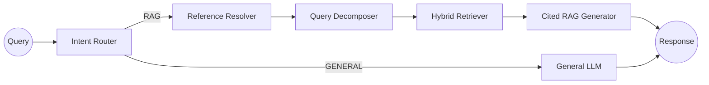
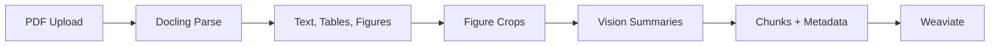

# multimodal-agentic-knowledge-base

<p align="center">
  <a href="https://www.python.org/"></a>
  <a href="https://fastapi.tiangolo.com/"></a>
  <a href="https://www.docker.com/"></a>
  <a href="https://weaviate.io/"></a>
  <a href="https://langchain-ai.github.io/langgraph/"></a>
</p>

**A local-first multimodal agentic RAG app for chatting with PDF documents.**

Upload PDFs, ask questions, and get grounded answers with inline citations. The system parses text, tables, and figures, indexes them in Weaviate, and uses a LangGraph workflow for intent routing, reference resolution, query decomposition, hybrid retrieval, reranking, and answer generation.

## Outline

- [Highlights](#highlights)
- [Demo](#demo)
- [Quick Start](#quick-start)
- [How It Works](#how-it-works)
- [Evaluation Snapshot](#evaluation-snapshot)
- [Configuration](#configuration)
- [Development](#development)
- [License](#license)

## Highlights

- **Multimodal PDF ingestion**: Docling extracts text, tables, captions, page metadata, and figure crops; figures are summarized with a vision-capable LLM for retrieval.
- **Agentic RAG workflow**: LangGraph routes general vs retrieval questions, resolves follow-up references, decomposes multi-topic questions, retrieves evidence, and generates cited answers.
- **Hybrid retrieval**: Weaviate combines BM25 and BGE-M3 vector search, followed by an app-level mMARCO cross-encoder reranker on CPU.
- **Local-first retrieval stack**: embeddings, vector storage, chat memory, and processed citation assets run locally through Docker.
- **Persistent conversations and jobs**: PostgreSQL stores LangGraph chat memory and background ingestion job status.
- **Vietnamese + English behavior**: Vietnamese questions are resolved, decomposed, and answered in Vietnamese; English questions stay in English.
- **Docker-focused deployment**: dependencies are locked with `uv.lock`; Phoenix tracing is isolated to the dev compose stack; Weaviate and text2vec containers have configurable memory limits.

## Demo

<p align="center">
  <video src="https://github.com/user-attachments/assets/0b603341-19b6-4a56-a7be-b5142e89f0cb" width="700" controls="controls"></video>
  <br>
  <em>End-to-end demo: ingestion, retrieval, and citation generation</em>
</p>

## Quick Start

Prerequisites: Docker Desktop, Docker Compose, a Groq API key, and a Google AI Studio API key. Recommended Docker Desktop resources: 8 CPU cores, 12-16 GB RAM, and 35 GB free disk.

```bash
git clone https://github.com/phuocNg964/multimodal-agentic-knowledge-base.git
cd multimodal-agentic-knowledge-base
cp .env.example .env
```

Set the required keys in `.env`:

```env
GROQ_API_KEY=...
GEMINI_API_KEY=...
```

Start the default local stack:

```bash
docker compose up -d
```

Open:

| Service | URL |
|---|---|
| App/API | `http://localhost:8000` |
| API docs | `http://localhost:8000/docs` |

Useful commands:

```bash
docker compose logs -f api
docker compose restart api
docker compose down
docker stats --no-stream
```

Optional modes:

```bash
# Development: source/config mounts + Phoenix tracing
docker compose -f docker-compose.yaml -f docker-compose.dev.yaml up -d

# GPU override for embedding/reranking services
docker compose -f docker-compose.yaml -f docker-compose.gpu.yaml --profile gpu up -d
```

Health check:

```bash
curl http://localhost:8000/health
curl http://localhost:8000/ready
```

## How It Works

<p align="center">
  
  <br>
  <em>Runtime architecture and core technology stack</em>
</p>

Core services:

| Service | Role |
|---|---|
| FastAPI API | browser UI, REST API, ingestion jobs, chat endpoints |
| Weaviate | BM25 + vector search over parsed chunks |
| text2vec-transformers | local `baai-bge-m3` embeddings |
| PostgreSQL | LangGraph memory and ingestion job state |
| Phoenix | dev-only tracing through `docker-compose.dev.yaml` |

Agent flow:


```mermaid
graph LR
    Start((Query)) --> Router[Intent Router]
    Router -->|RAG| Resolver[Reference Resolver]
    Router -->|GENERAL| General[General LLM]
    Resolver --> Decomposer[Query Decomposer]
    Decomposer --> Retriever[Hybrid Retriever]
    Retriever --> Generator[Cited RAG Generator]
    Generator --> End((Response))
    General --> End
```

Ingestion flow:


```mermaid
graph LR
    A[PDF Upload] --> B[Docling Parse]
    B --> C[Text, Tables, Figures]
    C --> D[Figure Crops]
    D --> E[Vision Summaries]
    E --> F[Chunks + Metadata]
    F --> G[Weaviate]
```

Notable implementation choices:

- Native PDFs skip OCR; scanned PDFs use EasyOCR with Vietnamese + English defaults.
- Figure/table crops are stored under `data/processed` and referenced by citation paths.
- Failed ingestion rolls back partially inserted Weaviate chunks.
- The default stack excludes Phoenix to reduce runtime memory; dev compose adds it back.

## Evaluation Snapshot

Final run: `final_evaluation_20`.

Setup:

| Item | Value |
|---|---|
| Runtime | Docker API, full LangGraph agent workflow |
| Collection | `DoclingPapers` |
| Dataset | `data/gold/gold_dataset_v4.jsonl` |
| Gold samples | 50 total, 20 varied samples evaluated |
| Sample strategy | Balanced by question type and question length |
| Judge LLM | `gpt-4o-mini` |
| Eval embeddings | `text-embedding-3-small` |
| Concurrency | 1 |

Each sample is sent through the same `/collections/{collection}/chat` API used by the app UI, so the evaluated path includes routing, reference resolution, query decomposition, retrieval, reranking, and generation.

Method: RAGAS Metrics

| Metric | What it checks |
|---|---|
| Context Recall | Whether the retrieved contexts cover the information needed from the gold answer. |
| Context Precision | Whether retrieved contexts are relevant instead of noisy. |
| Faithfulness | Whether the generated answer is supported by the retrieved contexts. |
| Answer Relevancy | Whether the generated answer directly addresses the user question. |

RAGAS uses `gpt-4o-mini` as the judge LLM and `text-embedding-3-small` for embedding-based scoring. Phoenix is used to run and track the experiment; results are logged under `logs/run_evals.log` and exported by the evaluation runner.

| Metric | Score |
|---|---:|
| Context Recall | 0.9667 |
| Context Precision | 0.9434 |
| Faithfulness | 0.9192 |
| Answer Relevancy | 0.8345 |

Average API latency was `5.52s` per query. Evaluation scripts live in `evals/` and require `OPENAI_API_KEY` for judge/embedding models.

Reproduce:

```bash
uv sync --frozen
uv run python -m evals.run_evals \
  --collection DoclingPapers \
  --dataset data/gold/gold_dataset_v4.jsonl \
  --run-name final_evaluation_20 \
  --samples 20 \
  --concurrency 1
```

## Configuration

The main runtime knobs are in `.env.example`:

| Area | Key settings |
|---|---|
| LLM keys | `GROQ_API_KEY`, `GEMINI_API_KEY`, optional `OPENAI_API_KEY` |
| Reranking | `RERANKER_MODE`, `APP_RERANKER_MODEL`, `WARMUP_RERANKER` |
| Retrieval | `RETRIEVAL_TOP_K`, `RETRIEVAL_TOP_K_RERANKER`, `RETRIEVAL_ALPHA` |
| Docker memory | `WEAVIATE_MEM_LIMIT`, `WEAVIATE_GOMEMLIMIT`, `TEXT2VEC_MEM_LIMIT` |
| Ingestion | `WARMUP_DOCLING`, `MAX_UPLOAD_SIZE_MB` |
| Dev tracing | `PHOENIX_COLLECTOR_ENDPOINT` |

LLM roles are configured in `configs/model/models.yaml`. The current default uses Groq Llama Scout for RAG/image summarization, Groq Llama 3.1 8B for routing/resolution/decomposition, and Gemini/Gemma fallbacks.

## Development

Source layout:

```text
src/api/          FastAPI app and routes
src/agentic_rag/  LangGraph workflow
src/components/   ingestion, parsing, retrieval, reranking
src/core/         config, database, job store, telemetry
src/models/       LLM provider adapters
src/prompts/      prompt templates
static/           browser UI
configs/model/    model role configuration
evals/            evaluation runner and metrics
```

Run locally with Python 3.11 and uv:

```bash
uv sync --frozen
uv run python main.py
```

Run checks:

```bash
make check
# or
uv run python -m compileall -q src evals main.py
uv run ruff check src evals main.py
```

## License

MIT
