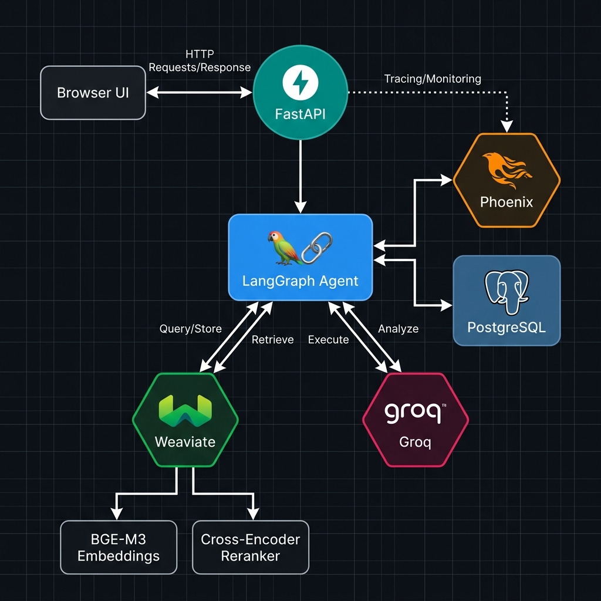
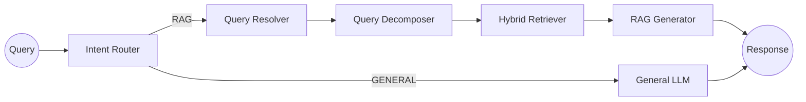
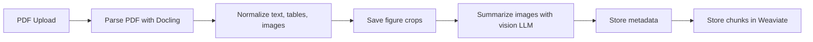

# multimodal-agentic-knowledge-base

<p align="center">
  <a href="https://www.python.org/"></a>
  <a href="https://fastapi.tiangolo.com/"></a>
  <a href="https://www.docker.com/"></a>
  <a href="https://www.postgresql.org/"></a>
  <br>
  <a href="https://weaviate.io/"></a>
  <a href="https://langchain-ai.github.io/langgraph/"></a>
  <a href="https://groq.com/"></a>
  <a href="https://opensource.org/licenses/MIT"></a>
</p>

**A local-first agentic RAG app for chatting with PDF documents.**

Upload PDFs, ask questions, and get grounded answers with source citations. The system parses text, tables, and figures, stores chunks in Weaviate, and uses a LangGraph workflow for query routing, rewriting, retrieval, and answer generation.

## Key Features

- **Agentic workflow**: LangGraph handles routing, coreference resolution, query decomposition, retrieval, and generation.
- **Multimodal ingestion**: Docling extracts text, tables, captions, and figure crops from PDFs.
- **Hybrid search**: Weaviate BM25 + vector search with cross-encoder reranking.
- **Local-first retrieval**: Embeddings run locally through Docker. CPU deployments use an app-level mMARCO reranker cached in the API image.
- **Persistent state**: PostgreSQL stores chat memory and ingestion job status across restarts.
- **Docker-first deployment**: Production dependencies are locked with `uv.lock` and installed with `uv sync --frozen --no-dev`.

## Demo

<p align="center">
  <video src="https://github.com/user-attachments/assets/0b603341-19b6-4a56-a7be-b5142e89f0cb" width="700" controls="controls"></video>
  <br>
  <em>End-to-end demo: ingestion, retrieval, and citation generation</em>
</p>

<p align="center">
  
  <br>
  <em>Ask questions and get answers with inline citations and source documents</em>
</p>

<p align="center">
  
  <br>
  <em>Upload PDFs and track background ingestion status</em>
</p>

## Getting Started

### Prerequisites

- Docker Desktop with Docker Compose.
- Python 3.11 if you want to run local scripts or tests outside Docker.
- `uv` if you want to run source development or evaluation commands outside Docker.
- A [Groq API key](https://console.groq.com/keys). The default `configs/model/models.yaml` uses Groq.
- Free local ports: `8000` for the app/API, `8080` and `50051` for Weaviate, `5432` for Postgres. Phoenix also uses `6006` and `4317` when observability is enabled.
- Recommended Docker Desktop resources: 8 CPU cores, 12-16 GB RAM, and at least 15 GB free disk for images, cached models, and indexed documents.

### TL;DR (any OS)

```bash
git clone https://github.com/phuocNg964/multimodal-agentic-knowledge-base.git
cd multimodal-agentic-knowledge-base
cp .env.example .env   # then set GROQ_API_KEY inside
./start.sh cpu         # Linux/macOS  |  Windows: .\start.bat cpu
```

Open `http://localhost:8000` once the stack is up.

---

### Windows Quick Start

```bat
git clone https://github.com/phuocNg964/multimodal-agentic-knowledge-base.git
cd multimodal-agentic-knowledge-base

copy .env.example .env
notepad .env
```

Set `GROQ_API_KEY` in `.env`, then start the CPU deployment:

```bat
.\start.bat cpu
```

Open:

```text
http://localhost:8000
```

Optional modes:

```bat
.\start.bat gpu
.\start.bat cpu --observability
```

### Linux / macOS Quick Start

```bash
git clone https://github.com/phuocNg964/multimodal-agentic-knowledge-base.git
cd multimodal-agentic-knowledge-base

cp .env.example .env
nano .env   # set GROQ_API_KEY
```

Start the CPU deployment:

```bash
./start.sh cpu
```

Open:

```text
http://localhost:8000
```

Optional modes:

```bash
./start.sh gpu
./start.sh cpu --observability
```

### Manual Docker Start

Use this if you do not want to run `start.bat`:

```bash
docker compose --profile cpu --profile production up -d --build
```

For GPU embedding/reranker services:

```bash
docker compose --profile gpu --profile production up -d --build
```

For Phoenix tracing:

```bash
DOCKER_PHOENIX_COLLECTOR_ENDPOINT=http://phoenix:4317 docker compose --profile cpu --profile production --profile observability up -d --build
```

The first Docker build downloads base images, Python packages, Docling models, and the default reranker model. Later builds should be faster when Docker cache is intact.

### Common Commands

Start the default CPU stack:

```bash
docker compose --profile cpu --profile production up -d
```

Stop the stack:

```bash
docker compose --profile cpu --profile production down
```

Restart only the API:

```bash
docker compose --profile cpu --profile production restart api
```

Rebuild the API image after source or dependency changes:

```bash
docker compose --profile cpu --profile production up -d --build api
```

Reload `.env` changes, such as a new `GROQ_API_KEY`:

```bash
docker compose --profile cpu --profile production up -d --force-recreate --no-deps api
```

View API logs:

```bash
docker compose --profile cpu --profile production logs -f api
```

Reset local Docker data volumes:

```bash
docker compose --profile cpu --profile production down -v
```

This deletes local Weaviate, Postgres, Phoenix, and processed-file volumes. It does not delete PDFs under `data/raw` because that folder is bind-mounted from your workspace.

## Smoke Test

After startup, verify health and readiness:

```bash
python scripts/smoke_test.py
```

Run an end-to-end check with PDF upload, ingestion, and chat:

```bash
python scripts/smoke_test.py --pdf path/to/sample.pdf
```

On Windows, quote PDF paths that contain spaces or Vietnamese characters:

```powershell
python scripts\smoke_test.py --pdf "data\raw\Papers\BM17_Tom tat bao cao_Tr05.pdf"
```

The full smoke test checks `/health`, `/ready`, collection creation, PDF upload, ingestion job status, and a basic chat response.

## Usage

1. Open `http://localhost:8000`.
2. Create a collection.
3. Upload one or more PDF files.
4. Wait for ingestion to complete.
5. Ask questions in the chat view.

The ingestion pipeline uses a vision-capable LLM to summarize images. Free API tiers can hit rate limits on image-heavy PDFs, so start with smaller documents when testing.

Uploads run as background ingestion jobs. Wait until the document status is complete before using it for chat.

## How It Works

### System Architecture



Core services:

- **API**: FastAPI app served on `127.0.0.1:8000`.
- **Weaviate**: local vector database with BM25 and vector search.
- **text2vec-transformers**: local `baai-bge-m3` embedding service.
- **Postgres**: LangGraph memory and ingestion job storage.
- **Phoenix**: optional tracing UI and OTLP collector.
- **External LLM provider**: default Groq for generation, routing, rewriting, decomposition, and image summarization.

### Agentic Workflow


```mermaid
graph LR
    Start(("Query")) --> Router["Intent Router"]
    Router -->|RAG| Resolver["Query Resolver"]
    Router -->|GENERAL| General["General LLM"]
    Resolver --> Decomposer["Query Decomposer"]
    Decomposer --> Retriever["Hybrid Retriever"]
    Retriever --> Generator["RAG Generator"]
    Generator --> End(("Response"))
    General --> End
```

| Node | What it does |
|---|---|
| Intent Router | Classifies whether the query needs retrieval or can be answered conversationally. |
| Query Resolver | Resolves pronouns and follow-up references using recent chat history. |
| Query Decomposer | Splits multi-topic questions into independent sub-queries. |
| Hybrid Retriever | Runs BM25 + vector search, fetches broad candidates, reranks, and deduplicates. |
| RAG Generator | Produces a cited answer from retrieved text and image context. |

Conversation memory is persisted in PostgreSQL through LangGraph's Postgres checkpointer.

### Ingestion Pipeline


```mermaid
graph LR
    A["PDF Upload"] --> B["Parse PDF with Docling"]
    B --> C["Normalize text, tables, images"]
    C --> D["Save figure crops"]
    D --> E["Summarize images with vision LLM"]
    E --> F["Store metadata"]
    F --> G["Store chunks in Weaviate"]
```

- **Docling parsing** extracts text, tables, page numbers, captions, and figure crops.
- **OCR selection** skips OCR for native PDFs and uses EasyOCR for scanned PDFs.
- **OCR language**: the default EasyOCR configuration recognises Vietnamese and English (`["vi", "en"]`). To support other languages, edit the `ocr_options` in `src/components/docling_parser.py` and update `easyocr`'s supported language list in your environment.
- **Image summarization** turns figures into searchable text with caption and section context.
- **Portable assets** store citation image paths relative to `data/processed`.
- **Failure rollback** removes partially inserted chunks if ingestion fails.
- **Optional warmup**: set `WARMUP_DOCLING=true` to pay Docling setup cost at startup instead of on the first upload.

## Design Decisions

| Decision | Why |
|---|---|
| Hybrid search | BM25 catches exact terms; vectors catch semantic matches. |
| Two-stage retrieval | Fetching broad candidates improves recall; cross-encoder reranking improves precision. |
| Resolver before decomposer | Coreference resolution and multi-topic splitting fail differently, so they are separate graph nodes. |
| Local embeddings | Document text stays local during retrieval and avoids per-query embedding API costs. |
| App-level CPU reranker | CPU deployments avoid the extra Weaviate reranker service and use a cached mMARCO cross-encoder in the API image. |
| PostgreSQL memory | Chat history and ingestion jobs survive API restarts. |
| Locked Docker dependencies | `pyproject.toml` defines dependencies and `uv.lock` pins the build graph for reproducible Docker builds. |

The default `docker-compose.yaml` is production-clean: the API runs code from the built Docker image. Use `docker-compose.dev.yaml` only when you want live source mounts during development.

## Evaluation

The evaluation pipeline lives under `evals/` and uses RAGAS/Phoenix experiments.

Previously evaluated setup:

- Synthetic dataset: 47 queries from 6 AI research papers.
- Query types: fact retrieval, comparison, multi-hop reasoning, and table extraction.
- Judge: `gpt-4o-mini`.
- Context similarity embeddings: `text-embedding-3-small`.
- Local retrieval hardware: Docker Desktop with 16 CPUs and 8 GB RAM.

| Metric | Score |
|---|---:|
| Context Recall | 0.9348 |
| Context Precision | 0.8866 |
| Faithfulness | 0.8859 |
| Answer Relevancy | 0.7972 |

To install dev/eval dependencies and run evaluations:

```bash
uv sync --frozen
uv run python -m evals.run_evals
```

Generated eval outputs under `evals/results/` are local artifacts and should not be committed. Curated benchmark notes live in `docs/benchmarks.md`.

## Configuration

### LLM Models

LLM roles are configured in `configs/model/models.yaml`:

```yaml
llms:
  rag_generator:
    provider: groq
    model: meta-llama/llama-4-scout-17b-16e-instruct
    temperature: 0.1

  router:
    provider: groq
    model: llama-3.1-8b-instant
    temperature: 0.1
```

Supported providers include `groq`, `openai`, `gemini`, `ollama`, and `huggingface`.

For local Ollama in Docker Desktop, set the provider to `ollama` and use:

```yaml
model_kwargs:
  base_url: http://host.docker.internal:11434
```

### Environment Variables

| Variable | Required | Default | Description |
|---|---|---|---|
| `GROQ_API_KEY` | Yes for default config | none | Default LLM provider key. |
| `GEMINI_API_KEY` | No | none | Required only if `models.yaml` uses Gemini. |
| `OPENAI_API_KEY` | No | none | Required only if `models.yaml` uses OpenAI. |
| `WEAVIATE_HOST` | No | `localhost` | Weaviate host for local source runs. Docker overrides this to `weaviate`. |
| `WEAVIATE_HTTP_PORT` | No | `8080` | Weaviate HTTP port. |
| `WEAVIATE_GRPC_PORT` | No | `50051` | Weaviate gRPC port. |
| `PG_HOST` | No | `localhost` | Postgres host for local source runs. Docker overrides this to `postgres`. |
| `PHOENIX_COLLECTOR_ENDPOINT` | No | unset | Enables tracing when set. |
| `DOCKER_PHOENIX_COLLECTOR_ENDPOINT` | No | unset | Docker-only Phoenix endpoint, usually `http://phoenix:4317`. |
| `RERANKER_MODE` | No | `app` | `app`, `weaviate`, or `none`. |
| `APP_RERANKER_MODEL` | No | `cross-encoder/mmarco-mMiniLMv2-L12-H384-v1` | App-level reranker model. |
| `APP_RERANKER_DEVICE` | No | `cpu` | App-level reranker device. |
| `APP_RERANKER_BATCH_SIZE` | No | `8` | App-level reranker batch size. |
| `WARMUP_RERANKER` | No | `true` | Warm app-level reranker during API startup. |
| `RETRIEVAL_TOP_K` | No | `20` | Candidates fetched per query before final reranking. |
| `RETRIEVAL_TOP_K_RERANKER` | No | `5` | Final retrieved docs sent to generation. |
| `WEAVIATE_ENABLE_MODULES` | No | `text2vec-transformers` | Weaviate modules enabled by Docker Compose. |
| `WEAVIATE_RERANKER_INFERENCE_API` | No | `http://reranker-transformers:8080` | Used when Weaviate reranker mode is enabled. |
| `WARMUP_DOCLING` | No | `false` | Warm Docling models during API startup. |
| `MAX_UPLOAD_SIZE_MB` | No | `100` | Maximum uploaded PDF size. |
| `PG_POOL_MAX_SIZE` | No | `5` | Max Postgres connections for LangGraph memory. |

## API Reference

Interactive docs are available at `http://localhost:8000/docs`.

```text
GET    /health
GET    /ready

GET    /collections
POST   /collections
DELETE /collections/{name}

POST   /collections/{name}/documents
GET    /collections/{name}/documents
DELETE /collections/{name}/documents/{filename}

GET    /collections/jobs/{job_id}

POST   /collections/{name}/chat
POST   /collections/{name}/chat/stream
GET    /collections/{name}/chat/history
DELETE /collections/{name}/chat/history
```

## Tech Stack

| Component | Technology |
|---|---|
| API | FastAPI |
| Agent workflow | LangGraph |
| Vector database | Weaviate |
| Embeddings | `baai-bge-m3` through Weaviate `text2vec-transformers` |
| CPU reranker | App-level `cross-encoder/mmarco-mMiniLMv2-L12-H384-v1` |
| GPU/legacy reranker | Optional Weaviate reranker service |
| LLM providers | Groq, OpenAI, Gemini, Ollama, HuggingFace |
| PDF processing | Docling, EasyOCR, PyMuPDF |
| State storage | PostgreSQL |
| Observability | Phoenix + OpenTelemetry |
| Dependency locking | `pyproject.toml` + `uv.lock` |

## Project Structure

```text
configs/model/models.yaml       LLM provider and model configuration
src/agentic_rag/agent_workflow.py
src/api/main.py                 FastAPI app and readiness endpoints
src/api/routes/                 Collections, documents, and chat routes
src/components/docling_parser.py
src/components/ingestion.py
src/components/retriever.py
src/core/config.py              Environment settings
src/core/database.py            Weaviate collection/document service
src/core/job_store.py           Persistent ingestion jobs
src/core/names.py               Collection and filename validation
src/core/weaviate_client.py     Global Weaviate connection
src/models/base.py              LLM factory
src/models/local_slm.py         Ollama and HuggingFace providers
src/models/remote_llm.py        Groq, OpenAI, and Gemini providers
src/prompts/prompts.py
static/                         Browser UI
scripts/smoke_test.py           Deployment smoke test
tests/                          Minimal regression tests
evals/                          Evaluation scripts and results
docs/                           Screenshots and diagrams
docker-compose.yaml             Local deployment stack
docker-compose.dev.yaml         Developer override with src/static bind mounts
Dockerfile                      API image
pyproject.toml                  Dependency inputs
uv.lock                         Locked dependency graph
requirements.txt                Pip compatibility fallback (see warning inside)
requirements-dev.txt            Pip compatibility fallback for dev/eval
start.bat                       Windows Docker startup helper
start.sh                        Linux/macOS Docker startup helper
Makefile                        Developer shortcuts: make test, make check
.env.example                    Environment template
CONTRIBUTING.md                 Contribution guide
```

## Known Limitations

| Limitation | Detail |
|---|---|
| First Docker build is slow | Downloads ~5 GB of images, models, and packages. Subsequent builds reuse the cache. |
| Groq free tier rate limits | Image-heavy PDFs can hit the free API limit during summarization. Start with small PDFs. |
| CPU inference is slow | The default CPU profile uses software inference for embeddings. Expect ~1-3 s per query. |
| OCR defaults to Vietnamese + English | See the Ingestion Pipeline section above to change languages. |
| Single-user local deployment | The app is designed for local use. No authentication or multi-user support is included. |

## Troubleshooting

| Problem | Fix |
|---|---|
| `/ready` returns `503` | Check the dependency map in the response, then inspect logs with `docker compose --profile cpu --profile production logs -f api`. |
| New `.env` value is ignored | Recreate the API container with `docker compose --profile cpu --profile production up -d --force-recreate --no-deps api`. |
| Groq returns `429` | This is usually a tokens-per-minute or org-level quota limit. Lower eval concurrency, wait for quota reset, or use a higher Groq tier. |
| First build takes a long time | Docker downloads Python packages, Docling models, and reranker weights on the first build. Later builds reuse cache. |
| Docker Desktop is slow or unstable | Allocate at least 8 CPU cores and 12-16 GB RAM to Docker Desktop when ingesting PDFs. |
| Windows path fails in smoke test | Quote paths that contain spaces or Vietnamese characters. |

## Local Source Development

Docker is the recommended path for real users. For source development on Python 3.11:

```bash
uv sync --frozen
uv run python main.py
```

Run checks with `make`:

```bash
make test    # unit tests, no running stack required
make check   # syntax + ruff lint
```

Or directly with uv:

```bash
uv run pytest -q
uv run python -m compileall -q src tests main.py scripts/smoke_test.py scripts/reingest_doclingpapersv2_with_stats.py
uv run ruff check src tests main.py scripts
```

For Docker-based development with source mounts:

```bash
docker compose -f docker-compose.yaml -f docker-compose.dev.yaml --profile cpu --profile production up -d --build
docker compose -f docker-compose.yaml -f docker-compose.dev.yaml --profile cpu --profile production restart api
```

## License

MIT
